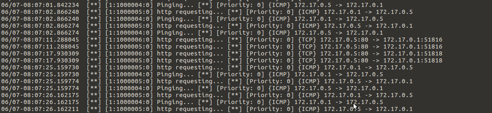

# Snort - Envoy 

Snort IDS side by side with Envoy and a webservice 

## Getting Started

### Installing and Testing

A step by step series of examples that tell you how to get  running example of Snort-Envoy in IDS mode

Build the container

```
docker build -t snort-envoy:v3 .
```

Log into the container
```
docker run --privileged --cap-add=NET_RAW -ti --name exhibition snort-envoy:v3 bash
```

Create the IP Blacklist
```
sh /usr/local/bin/blacklist.sh
```
Put the untrusted IP inside the blacklist
```
ipset add blacklist 172.17.0.1 (remove an ip with (ipset del blacklist 172.17.0.1))
```

Start the services
```
./start_snort_script.sh
```

## Running the tests
Ping/curl the container and snort will alert you about the ping iptables will block the ICMP/TCP request.




##	Snort -  Envoy in IPS mode (Container attached to two networks in order for SNort to redirect traffic)
![https://github.com/Kernelalive/envoy_tests/tree/master/Snort-Envoy:v2]
